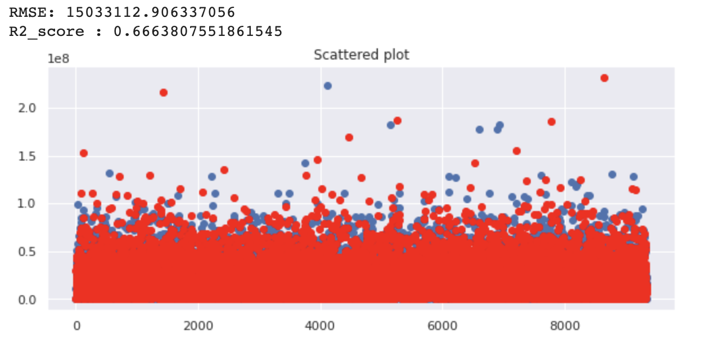
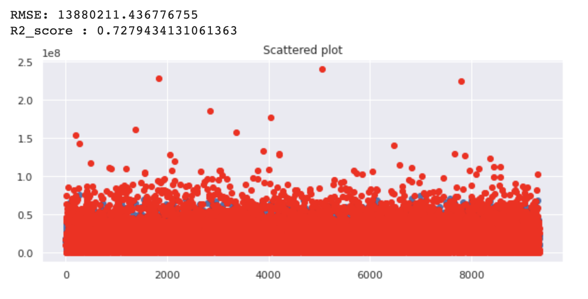
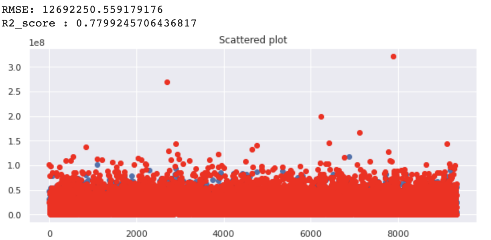

# Big Contest 

## 개발환경

#### python : 3.6.9 [GCC : 8.4.0]

#### pandas : 0.25.1

#### numpy : 1.18.5

#### auto-sklearn : 0.9.0

#### tensorflow : 2.3.0

## Project

* NS 홈쇼핑의 2019년 판매 데이터를 이용해 2020년 6월 데이터 예측

## 추가 자료

* 2019년 날씨 데이터 / 2020년 6월 날씨 데이터
* 시간별 온도 / 습도 / 날씨  데이터 추가

## Visualization

### Decision Tree

### LightGBM

### Auto-ML

